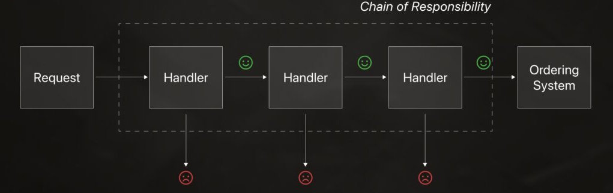

# challenge-alura-backend

Uma API REST para gerenciamento de reservas de salas construída com Spring Boot.

## Sobre o Projeto

Desenvolvido como parte do Challenge I de Backend Java da Alura, a API oferece uma solução completa para gerenciar reservas de salas, incluindo:

- **Gerenciamento de Usuários**: Criar, atualizar, deletar e listar usuários que podem fazer reservas
- **Gerenciamento de Salas**: Gerenciar salas disponíveis com suas capacidades
- **Sistema de Reservas**: Reservar salas com validação de conflitos de horário e limites de capacidade

O sistema possui validação inteligente para evitar reservas duplicadas e garante que o horário de término seja sempre posterior ao horário de início.

## Sobre o Challenge

O [Challenge I de Backend Java da Alura](https://cursos.alura.com.br/course/checkpoint-back-end-java-nivel-1) é uma proposta prática dividida em etapas progressivas, onde o objetivo é construir uma aplicação Java com Spring do zero. Cada etapa foca em um conjunto de habilidades:

1. **Modelagem de domínio** — entidades `Sala`, `Usuário` e `Reserva` com orientação a objetos e validações de negócio
2. **API REST** — endpoints CRUD com separação em camadas (controller / service / repository)
3. **Persistência** — mapeamento JPA, consultas por período para detectar conflitos e listagens paginadas
4. **Testes** — testes unitários para services e validações, cobrindo cenários de sucesso e erro
5. **Versionamento** — commits pequenos, mensagens claras e pull requests para mudanças significativas
6. **Docker** *(opcional)* — empacotamento da aplicação em contêiner para padronizar ambientes

## Design Patterns

### Chain of Responsibility — Validações de Reserva



As validações aplicadas ao criar ou atualizar uma reserva seguem o padrão **Chain of Responsibility**. Cada regra de negócio é implementada em uma classe separada que implementa a interface `ValidationReservaRequest`, e o `ReservaService` recebe automaticamente todas elas via injeção de dependência do Spring:

```java
private final List<ValidationReservaRequest> validations;
// ...
validations.forEach(v -> v.validate(dto));
```

Isso garante que adicionar uma nova validação não exige nenhuma alteração no serviço — basta criar uma nova classe que implemente a interface.

## Tecnologias

- [![Spring Boot][SpringBoot]][SpringBoot-url]
- [![Java][Java]][Java-url]
- [![PostgreSQL][PostgreSQL]][PostgreSQL-url]
- [![Docker][Docker]][Docker-url]
- [![Maven][Maven]][Maven-url]

## Pré-requisitos

- Java 21+
- Maven 3.x
- Docker & Docker Compose (opcional, para implantação em contêiner)
- PostgreSQL (se não estiver usando Docker)

## Instalação

### Opção 1: Usando Docker (Recomendado)

```sh
git clone https://github.com/rogerbertan/challenge-alura-backend.git
docker-compose up
```

Isso iniciará o banco de dados PostgreSQL e a aplicação na porta 8080.

### Opção 2: Configuração Manual

```sh
git clone https://github.com/rogerbertan/challenge-alura-backend.git
```

1. Configure o banco de dados PostgreSQL (crie um banco chamado `reservas`)
2. Atualize `src/main/resources/application-prod.properties` com as credenciais do banco
3. Execute a aplicação:
   ```sh
   ./mvnw spring-boot:run -Dspring-boot.run.profiles=prod
   ```

### Opção 3: Modo de Desenvolvimento (Banco H2)

```sh
git clone https://github.com/rogerbertan/challenge-alura-backend.git
./mvnw spring-boot:run -Dspring-boot.run.profiles=dev
```

Utiliza banco de dados H2 em memória, sem necessidade de configuração adicional.

## Uso

### Usuários (`/api/v1/usuarios`)

| Método | Endpoint                | Descrição                |
|--------|-------------------------|--------------------------|
| GET    | `/api/v1/usuarios`      | Listar todos os usuários |
| GET    | `/api/v1/usuarios/{id}` | Buscar usuário por ID    |
| POST   | `/api/v1/usuarios`      | Criar novo usuário       |
| PUT    | `/api/v1/usuarios`      | Atualizar usuário        |
| DELETE | `/api/v1/usuarios/{id}` | Deletar usuário          |

### Salas (`/api/v1/salas`)

| Método | Endpoint             | Descrição             |
|--------|----------------------|-----------------------|
| GET    | `/api/v1/salas`      | Listar todas as salas |
| GET    | `/api/v1/salas/{id}` | Buscar sala por ID    |
| POST   | `/api/v1/salas`      | Criar nova sala       |
| PUT    | `/api/v1/salas`      | Atualizar sala        |
| DELETE | `/api/v1/salas/{id}` | Deletar sala          |

### Reservas (`/api/v1/reservas`)

| Método | Endpoint                         | Descrição                  |
|--------|----------------------------------|----------------------------|
| GET    | `/api/v1/reservas`               | Listar reservas (paginado) |
| GET    | `/api/v1/reservas/{id}`          | Buscar reserva por ID      |
| POST   | `/api/v1/reservas`               | Criar reserva              |
| PUT    | `/api/v1/reservas`               | Atualizar reserva          |
| DELETE | `/api/v1/reservas/cancelar/{id}` | Cancelar reserva           |

### Exemplo de Requisição

```sh
curl -X POST http://localhost:8080/api/v1/usuarios \
  -H "Content-Type: application/json" \
  -d '{"nome": "João Silva", "email": "joao@exemplo.com"}'
```

Para mais exemplos, consulte a [Coleção do Postman](postman_collection.json).

<!-- LINKS E IMAGENS MARKDOWN -->

[contributors-shield]: https://img.shields.io/github/contributors/rogerbertan/challenge-alura-backend.svg?style=for-the-badge
[contributors-url]: https://github.com/rogerbertan/challenge-alura-backend/graphs/contributors
[forks-shield]: https://img.shields.io/github/forks/rogerbertan/challenge-alura-backend.svg?style=for-the-badge
[forks-url]: https://github.com/rogerbertan/challenge-alura-backend/network/members
[stars-shield]: https://img.shields.io/github/stars/rogerbertan/challenge-alura-backend.svg?style=for-the-badge
[stars-url]: https://github.com/rogerbertan/challenge-alura-backend/stargazers
[issues-shield]: https://img.shields.io/github/issues/rogerbertan/challenge-alura-backend.svg?style=for-the-badge
[issues-url]: https://github.com/rogerbertan/challenge-alura-backend/issues
[SpringBoot]: https://img.shields.io/badge/Spring_Boot-6DB33F?style=for-the-badge&logo=spring-boot&logoColor=white
[SpringBoot-url]: https://spring.io/projects/spring-boot
[Java]: https://img.shields.io/badge/Java-ED8B00?style=for-the-badge&logo=openjdk&logoColor=white
[Java-url]: https://openjdk.org/
[PostgreSQL]: https://img.shields.io/badge/PostgreSQL-316192?style=for-the-badge&logo=postgresql&logoColor=white
[PostgreSQL-url]: https://www.postgresql.org/
[Docker]: https://img.shields.io/badge/Docker-2496ED?style=for-the-badge&logo=docker&logoColor=white
[Docker-url]: https://www.docker.com/
[Maven]: https://img.shields.io/badge/Maven-C71A36?style=for-the-badge&logo=apache-maven&logoColor=white
[Maven-url]: https://maven.apache.org/